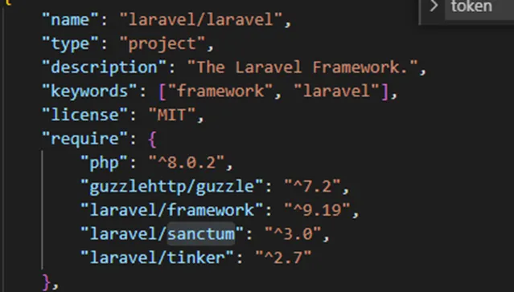
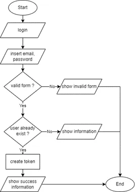
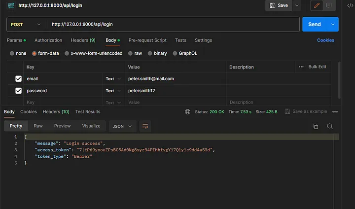
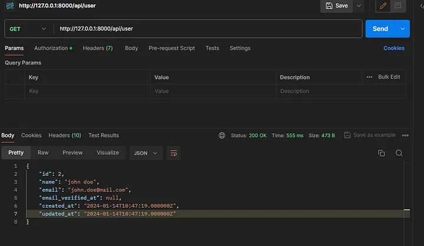
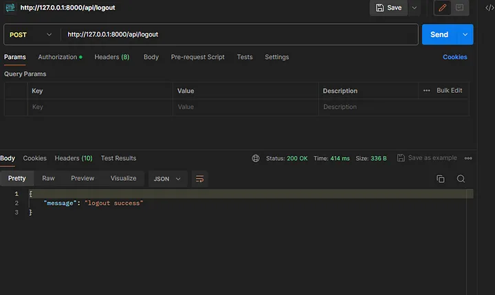

(https://medium.com/@hendriks96?source=post_page-----c4eeaa99b472--------------------------------)


The latest version of Laravel offers the latest authentication feature, Laravel Sanctum. A simple authentication that can be used in SPA (single page application), mobile applications, and token based APIS. Quoted from laravel documentation ”[Laravel Sanctum](https://github.com/laravel/sanctum) provides a featherweight authentication system for SPAs (single page applications), mobile applications, and simple, token based APIs. Sanctum allows each user of your application to generate multiple API tokens for their account. These tokens may be granted abilities / scopes which specify which actions the tokens are allowed to perform”.

Here I will not explain more about Laravel Sanctum, its advantages or disadvantages, but I will explain the basic implementation of using Laravel Sanctum in Laravel projects. For information regarding the explanation of Laravel Sanctum, you can see the documentation directly at [here](https://laravel.com/docs/10.x/sanctum#main-content).

**Introduction**

Before starting, prepare the tools below to support project creation

-   Code editor, visual studio code, sublime text, Intellij, or etc..
-   mysql
-   Composer
-   Postman

**Installation**

Install the Laravel project using composer, run the following command in the terminal

```
composer create-project –prefer-dist laravel/laravel sanctum-example
```

Wait until the project creation process is complete. Then open project using code editor.

**Setup database**

Create a new database with the name “sanctum\_example” in phpMyAdmin. Then open the `.env` file in the Laravel sanctum -example project. 

Set up the database as follows :

```php
DB_CONNECTION=mysql
DB_HOST=127.0.0.1
DB_PORT=3306
DB_DATABASE=sanctum_example
DB_USERNAME=root
DB_PASSWORD=
```

Run a new terminal in visual studio code. Terminal -> New terminal (ctrl + shift + '). Then type the command :

```bash
php artisan migrate
```

This command will run the migration command in Laravel and will automatically create a table in the database.

If successful, there will be a table in MySQL which was generated from the Laravel migration database.


default table user

**Setup Laravel Sanctum Package**

In Laravel version 9 and above, Laravel Sanctum is automatically installed when we create a Laravel project. We can check via the `composer.json` file



composer.json

If it doesn’t exist yet, you can install it via command

```bash
composer require laravel/sanctum
```

Then we publish the Laravel Sanctum configuration with the command

```bash
php artisan vendor:publish –provider="Laravel\Sanctum\SanctumServiceProvider"
```

**Setup Controller**

Create a new controller using the command

```
php artisan make:controller Api/AuthController
```

Next, open the AuthController.php file in app\\http\\controllers\\api.

Create 3 function in AuthController.php, register, login and logout


function in authcontroller.php

**Register**

We will create a simple registration, in this example we will create a user registration using name, email and password. We will create the following use case :


register use case

In the register function, add code to validate the form submitted by the user. Add the following code

```php
$validator = Validator::make(
	$request->all(), 
	[
		'name'  => 'required|string|max:255',
		'email' => 'required|string|max:255|unique:users',
		'password'  => 'required|string'              
	]);
if ($validator->fails()) {
	return response()->json($validator->errors());
}
```

Next, add code to save user data if the form submitted is valid.

```php
$user = User::create([            'name'      => $request->name,            'email'     => $request->email,            'password'  => Hash::make($request->password)        ]);$token = $user->createToken('auth_token')->plainTextToken;return response()->json([    'data'          => $user,    'access_token'  => $token,    'token_type'    => 'Bearer']);
```

The code above will save user data into the database and generate a token, we will send the token to the user.

Don’t forget to import the controller.

```php
use App\Models\User;
use Illuminate\Support\Facades\Hash;
use Illuminate\Support\Facades\Validator;
```

Next we will set api routes, open api.php in app\\routes\\api.php and add the following code :

```php
Route::post('/register', [AuthController::class, 'register']);
```

Don’t forget to import the authcontroller class file

```php
use App\Http\Controllers\Api\AuthController;
```

Then, run laravel server using artisan

```
php artisan serve
```

Open postman, and run api url

Method: POST

URL : [http://127.0.0.1:8000/api/register](http://127.0.0.1:8000/api/register)

Headers: Accept: application/json

Body: name,email,password


post register user

**Login**

Next we will create a login api that we can use to authenticate users



login use case

We will create a use case like the one above, almost the same as when we created the api register. Add code to validate email and password data.

```php
$validator = Validator::make($request->all(), [                'email'     => 'required|string|max:255',                'password'  => 'required|string'              ]);if ($validator->fails()) {    return response()->json($validator->errors());}
```

then add the code to authenticate the user.

```php
$credentials    =   $request->only('email', 'password');if (! Auth::attempt($credentials)) {    return response()->json([        'message' => 'User not found'    ], 401);}
```

If successfully validated as a registered user then we will generate a token, but if it fails then we will give the response “user not found”  
add the following code to generate token.

```php
$user   = User::where('email', $request->email)->firstOrFail();$token  = $user->createToken('auth_token')->plainTextToken;return response()->json([    'message'       => 'Login success',    'access_token'  => $token,    'token_type'    => 'Bearer']);
```

Then register the controller that we have created in routes api.php with the post method.

```php
Route::post('/login', [AuthController::class, 'login']);
```

Then run it on postman to test the login api

Method : POST

URL : [http://127.0.0.1:8000/api/login](http://127.0.0.1:8000/api/login)

Headers: Accept: application/json

Body : email, password



post login user

**Get User**

To get user data we will directly call user data via routes api, so add the following code to routes/api.php

```php
Route::middleware('auth:sanctum')->get('/user', function (Request $request) {    return $request->user();});
```

Now try calling the user endpoint to get the logged in user information, don’t forget to add the bearer token to Auth Postman.

|               |                                                                      |
| ------------- | -------------------------------------------------------------------- |
| Method        | `GET`                                                                |
| URL           | `[http://127.0.0.1:8000/api/login](http://127.0.0.1:8000/api/login)` |
| Headers       | `Accept : application, json`                                         |
| Authorization | `bearer token`                                                       |



get user successful

It’s good that we have got the user we wanted, To ensure that the URL can only give a successful response if there is a token, try changing authorization with no auth.


get user failed

The api response will return the message: Unauthenticated. Good, this indicates that our URL is working as expected

**Logout**

It’s not good if we add login but not logout, so we add the following code to the logout function that we prepared previously.

```php
Auth::user()->tokens()->delete();  return response()->json([      'message' => 'Logout successfull’  ]);
```

Don’t forget to register the logout routes in the api.php file with the post method

```php
Route::middleware('auth:sanctum')->group(function () {    Route::post('/logout', [AuthController::class, 'logout']);});
```

Now try to call the logout endpoint on our postman.

Method : POST

URL : [http://127.0.0.1:8000/api](http://127.0.0.1:8000/api/login)[/logout](http://127.0.0.1:8000/api/login)

Headers: Accept : application, json

Authorization: `Bearer token`



Nice, now we have successfully implemented authentication using Laravel Sanctum. A simple method offered by Laravel.

Apart from using Laravel Sanctum, we can use the Laravel Passport authentication method or the JWT (JSON Web Token) method. We will discuss these two authentication methods another time. Have a good learning.

